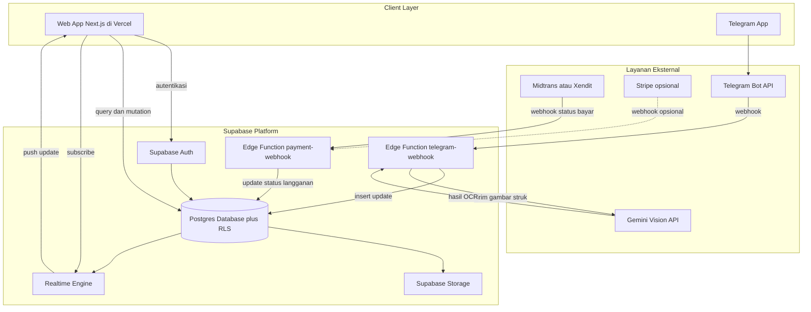
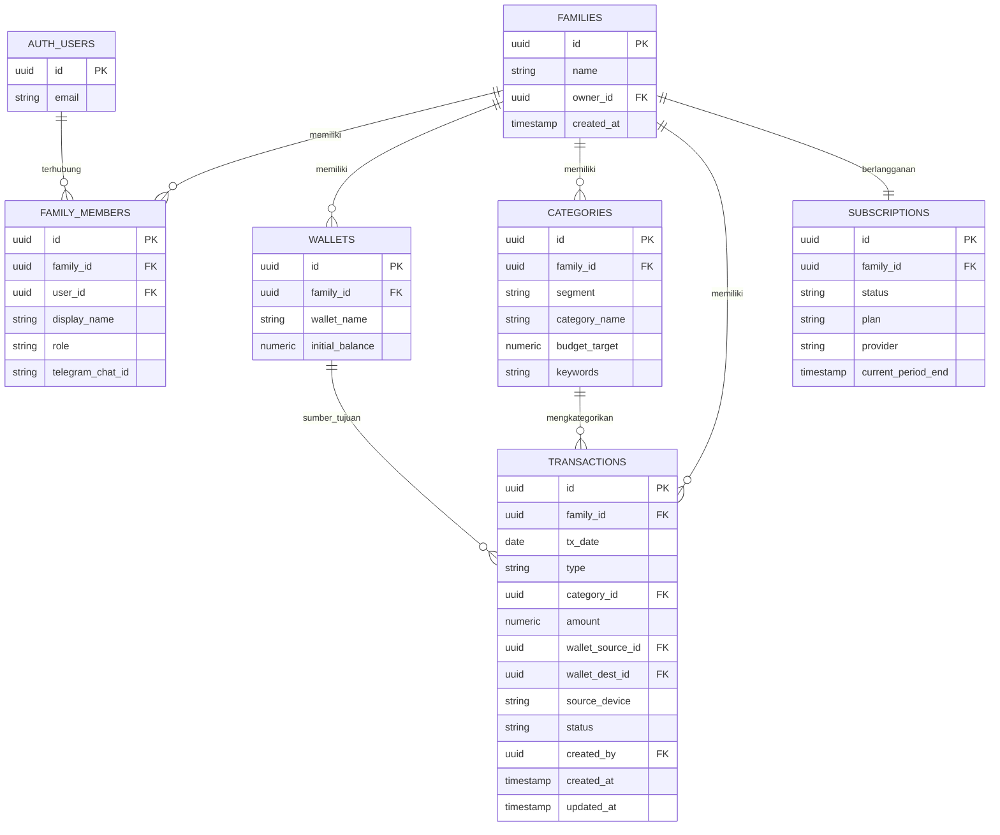
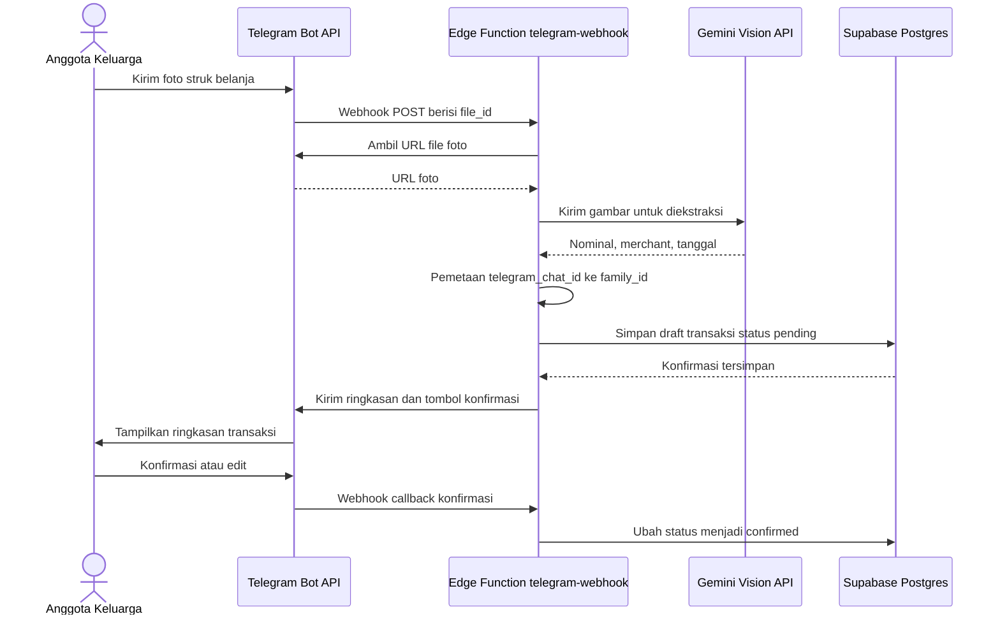
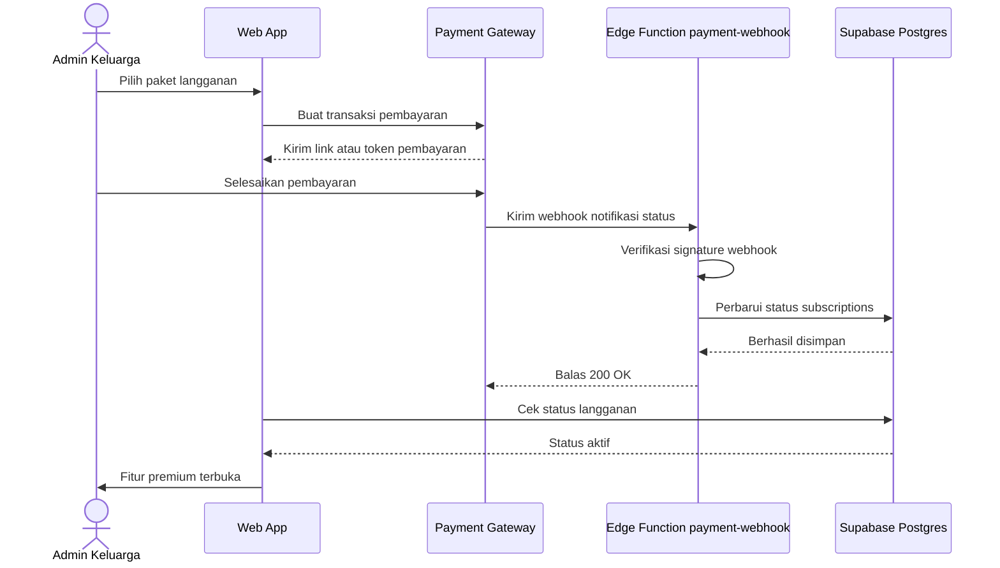
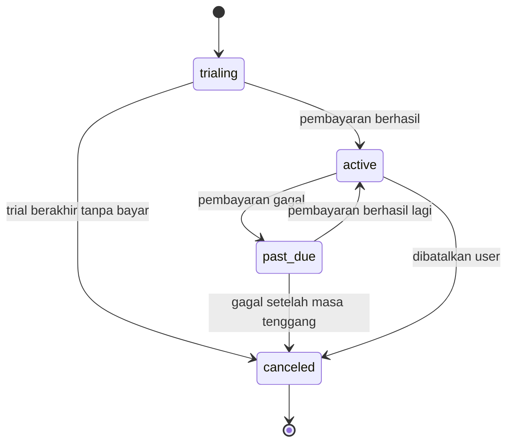
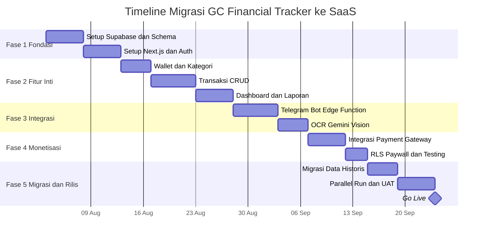

# Project Requirements Document (PRD)
## GC Financial Tracker — Migrasi ke SaaS (Supabase + Vercel)

| Field | Detail |
|---|---|
| Versi Dokumen | 1.0 |
| Tanggal | 21 Juli 2026 |
| Status | Draft untuk Review |
| Sumber | Merevisi `summary_SaaS.md` (dokumen strategi awal) |
| Disusun oleh | Senior Project Manager (AI-assisted review) |

---

## Daftar Isi

1. [Ringkasan Eksekutif](#1-ringkasan-eksekutif)
2. [Ringkasan Perubahan Kunci dari Draft Awal](#2-ringkasan-perubahan-kunci-dari-draft-awal)
3. [Latar Belakang & Problem Statement](#3-latar-belakang--problem-statement)
4. [Tujuan Proyek](#4-tujuan-proyek)
5. [Ruang Lingkup](#5-ruang-lingkup)
6. [Persona & Peran Pengguna](#6-persona--peran-pengguna)
7. [Functional Requirements (User Stories)](#7-functional-requirements-user-stories)
8. [Non-Functional Requirements](#8-non-functional-requirements)
9. [Arsitektur Sistem](#9-arsitektur-sistem)
10. [Model Data](#10-model-data)
11. [Spesifikasi Integrasi](#11-spesifikasi-integrasi)
12. [Rencana Migrasi Data](#12-rencana-migrasi-data)
13. [Tech Stack](#13-tech-stack)
14. [Strategi Deployment & Environment](#14-strategi-deployment--environment)
15. [Milestones & Timeline](#15-milestones--timeline)
16. [Risiko & Mitigasi](#16-risiko--mitigasi)
17. [Metrik Keberhasilan (KPI)](#17-metrik-keberhasilan-kpi)
18. [Lampiran](#18-lampiran)

---

## 1. Ringkasan Eksekutif

GC Financial Tracker saat ini berjalan di atas Google Apps Script + Google Sheets — cukup untuk kebutuhan satu keluarga, tapi punya batasan fundamental (kuota eksekusi, bukan database relasional, tidak ada isolasi multi-tenant) yang akan menjadi hambatan begitu produk ini dibuka sebagai layanan berlangganan untuk banyak keluarga sekaligus.

Dokumen ini merevisi rencana migrasi awal ke **Supabase + Vercel**, memperbaiki satu isu arsitektur kritis pada model data (lihat Bagian 2), dan menyusunnya menjadi spesifikasi teknis lengkap yang siap dieksekusi oleh tim maupun AI coding agent (lihat `Agent.md`).

> [!IMPORTANT]
> Perubahan paling penting di dokumen ini: seluruh data (dompet, kategori, transaksi) direstrukturisasi agar berbasis **`family_id`** (unit keluarga), bukan `user_id` (unit individu). Draft awal akan membuat setiap anggota keluarga punya data yang terisolasi satu sama lain — bertentangan langsung dengan tujuan produk ini.

---

## 2. Ringkasan Perubahan Kunci dari Draft Awal

| # | Area | Draft Awal | Revisi | Alasan |
|---|---|---|---|---|
| 1 | Model data multi-user | `user_id` langsung di `wallets`, `categories`, `transactions` | Tambah `families` + `family_members`; semua tabel data mereferensikan `family_id` | Draft awal mengisolasi data tiap anggota keluarga, padahal fitur inti adalah data yang dipakai bersama |
| 2 | Billing | `user_profiles` disebut di bagian monetisasi tapi tidak ada di skema DB | Tabel `subscriptions` terhubung ke `family_id` (1 keluarga = 1 subscription) | Konsisten dengan model family-based; billing adalah unit keluarga |
| 3 | Autentikasi | Login via email/password | Diarahkan menggunakan Google OAuth (Google SSO) | Mempermudah login dan meningkatkan keamanan tanpa password manual |
| 4 | Payment gateway | Stripe sebagai opsi setara Midtrans | Midtrans/Xendit sebagai gateway utama, Stripe opsional | Target pasar tampak Indonesia (harga IDR); QRIS/e-wallet lokal lebih relevan & konversi lebih tinggi |
| 5 | Frontend | Static HTML + Tailwind | Next.js (React, App Router) + Tailwind + shadcn/ui | Kompleksitas bertambah (auth, billing, dashboard multi-role) butuh struktur framework |
| 6 | Realtime sync | Tidak disebutkan | Manfaatkan Supabase Realtime antar anggota keluarga | Value proposition kuat untuk "family finance app", effort tambahan minim |
| 7 | Audit trail | `Status`/`Last_Modified` ada di legacy, tidak lengkap di skema baru | Tambah `updated_at`, `deleted_at` (soft-delete), `status` pada `transactions` | Data finansial butuh jejak audit & kemampuan pulihkan data |
| 8 | Keamanan webhook | Verifikasi signature tidak disebutkan | Wajib verifikasi signature Telegram & payment gateway di setiap Edge Function | Mencegah webhook palsu/fraud |
| 9 | Perhitungan saldo | Dihitung "real-time" tanpa spesifikasi implementasi | Formalkan sebagai SQL view `wallet_balances` | Konsistensi & performa dibanding hitung ulang di client |
| 10 | Versioning skema | Tidak disebutkan | Supabase CLI + migration files di git | Mencegah schema drift antar environment |

---

## 3. Latar Belakang & Problem Statement

Sistem saat ini menggunakan Google Apps Script sebagai lapisan API dan Google Sheets sebagai database. Pendekatan ini masuk akal sebagai MVP personal, tapi punya keterbatasan struktural:

- **Bukan database relasional** — tidak ada foreign key, index, atau constraint. Performa akan menurun seiring volume transaksi bertambah, dan integritas data (misalnya kategori yang salah ketik) tidak tercegah di level sistem.
- **Kuota eksekusi & API** — Google Apps Script memiliki batas kuota eksekusi dan pemanggilan harian yang berlaku ketat untuk akun non-Workspace, yang membatasi skalabilitas begitu banyak keluarga menggunakan sistem bersamaan.
- **Tidak ada isolasi multi-tenant** — sistem lama itu sendiri *single-tenant* (satu spreadsheet = satu keluarga). Begitu produk dibuka untuk banyak pelanggan, arsitektur data perlu berubah total, bukan sekadar dipindah host.
- **Keamanan minim** — kredensial API (misalnya Gemini key) berpotensi lebih sulit diisolasi sepenuhnya di lingkungan Apps Script dibanding server terdedikasi.

Rencana migrasi ke Supabase + Vercel pada dasarnya menjawab masalah ini, tapi draft awal membawa satu bug arsitektur yang, jika tidak dikoreksi sebelum development dimulai, akan merusak fitur inti produk (lihat Bagian 2, item #1).

---

## 4. Tujuan Proyek

**Tujuan Bisnis**
- Memonetisasi produk lewat model langganan (bulanan/tahunan/lifetime).
- Menjadikan "keluarga" sebagai unit pelanggan (bukan individu), sesuai sifat produk.

**Tujuan Teknis**
- Migrasi ke arsitektur yang scalable dan aman secara multi-tenant (RLS berbasis `family_id`).
- Menghilangkan ketergantungan pada kuota Google Apps Script/Sheets.
- Menjaga (dan meningkatkan) parity fitur dari sistem lama, termasuk Telegram Bot + OCR struk.

**Tujuan Pengalaman Pengguna**
- Tidak ada regresi fitur dibanding versi Google Sheets.
- Tambahan value baru: sinkronisasi real-time antar anggota keluarga.

---

## 5. Ruang Lingkup

### 5.1 Dalam Lingkup (In-Scope)
- Landing Page dengan Hero section & rincian paket berlangganan.
- Redesain data model multi-tenant berbasis keluarga (`family_id`).
- Migrasi backend ke Supabase (Postgres, Auth, Storage, Edge Functions).
- Migrasi frontend ke Next.js.
- Integrasi Telegram Bot (input teks + OCR foto struk) via Edge Function.
- Integrasi payment gateway (Midtrans/Xendit sebagai utama, Stripe opsional) & paywall berbasis RLS.
- Dashboard laporan bulanan & budget health.
- Migrasi data historis milik keluarga pertama (existing user) dari Google Sheets.

### 5.2 Di Luar Lingkup (Out-of-Scope untuk fase ini)
- Aplikasi mobile native (iOS/Android).
- Dukungan multi-currency.
- Integrasi langsung ke rekening bank (open banking).
- Multi-bahasa selain Bahasa Indonesia.
- Sub-kategori transaksi — field `Sub_Category` di sistem lama berstatus *reserved* (belum diimplementasikan). Bisa ditambahkan sebagai kolom nullable `sub_category_id` pada fase berikutnya tanpa breaking change.

---

## 6. Persona & Peran Pengguna

> [!NOTE]
> "Family" adalah unit bisnis utama — satu subscription melekat ke satu `family_id`, bukan ke individual user. Semua anggota dalam satu keluarga berbagi akses ke data yang sama, dibedakan lewat role.

| Role | Deskripsi | Hak Akses |
|---|---|---|
| **Admin** | Pemilik akun keluarga, biasanya yang pertama mendaftar & pemegang billing | Full akses: kelola anggota, wallet, kategori, transaksi, billing |
| **Editor** | Anggota keluarga aktif (mis. pasangan, anak dewasa) | CRUD transaksi & wallet, lihat laporan; tidak bisa kelola billing/anggota |
| **Viewer** | Anggota pasif (mis. orang tua yang hanya memantau) | Hanya baca laporan & transaksi, tidak bisa menulis |

---

## 7. Functional Requirements (User Stories)

### 7.1 Autentikasi & Manajemen Keluarga (Personal / Family Mode)
- **US-01**: Sebagai pengguna baru, setelah mendaftar/login **menggunakan Akun Google (Google OAuth)**, saya akan ditanya apakah aplikasi digunakan untuk "Personal" atau "Keluarga".
- **US-01b**: Jika "Personal", sistem otomatis membuat `family` dengan `account_type = 'personal'`, menyembunyikan fitur undangan anggota, dan menyesuaikan teks UI (misal: "Total Kekayaan" bukan "Total Kekayaan Keluarga").
- **US-02**: Jika "Keluarga", sebagai admin saya bisa mengundang anggota keluarga lain via email/link agar mereka bisa ikut mencatat transaksi.
- **US-03**: Sebagai anggota, saya login secara aman menggunakan Akun Google (Google OAuth) pada browser/perangkat saya.
- **US-04**: Sebagai admin (hanya di mode Keluarga), saya mengubah role anggota atau mengeluarkannya dari keluarga.

### 7.2 Manajemen Dompet (Wallets)
- **US-05**: Sebagai admin/editor, saya menambah dompet baru dengan saldo awal.
- **US-06**: Sebagai anggota, saya melihat saldo tiap dompet dihitung otomatis dan real-time dari histori transaksi.
- **US-07**: Sebagai anggota, saya memindahkan dana antar dompet (transfer internal).

### 7.3 Kategori & Budget
- **US-08**: Sebagai admin/editor, saya membuat kategori custom per segmen (Pengeluaran/Tagihan/Tabungan/Pemasukan/Liabilitas) dengan target budget bulanan.
- **US-09**: Sebagai admin/editor, saya menambahkan keyword pada kategori agar input teks Telegram bisa dipetakan otomatis.

### 7.4 Transaksi
- **US-10**: Sebagai anggota, saya mencatat transaksi manual lewat web app.
- **US-11**: Sebagai anggota, saya mengetik transaksi via chat Telegram dan sistem memetakan kategori otomatis dari keyword.
- **US-12**: Sebagai anggota, saya mengirim foto struk via Telegram; sistem mengekstraksi nominal & merchant otomatis (OCR) dan meminta konfirmasi saya sebelum tersimpan final.
- **US-13**: Setiap transaksi mencatat siapa pembuatnya (`created_by`) dan kapan (audit trail), serta bisa di-soft-delete (bukan hilang permanen).

### 7.5 Laporan & Dashboard
- **US-14**: Sebagai anggota, saya melihat dashboard ringkasan saldo seluruh dompet keluarga.
- **US-15**: Sebagai anggota, saya melihat grafik pengeluaran bulanan per kategori dibanding target budget.
- **US-16**: Sebagai anggota, perubahan data dari anggota lain muncul real-time tanpa saya perlu refresh manual.

### 7.6 Langganan & Billing

> [!TIP]
> Sesuai draft awal: **Bulanan** Rp 15.000–Rp 29.000, **Tahunan** Rp 99.000–Rp 149.000, **Lifetime** (Early Bird) Rp 199.000 dibatasi 100 user pertama. Rekomendasi: batasi kuota OCR bulanan bahkan untuk tier Lifetime, agar biaya API (Gemini Vision) tidak menggerus margin jangka panjang.

- **US-17**: Sebagai admin, saya memilih paket (bulanan/tahunan/lifetime) dan membayar via Midtrans/Xendit.
- **US-18**: Sebagai anggota keluarga, ketika langganan tidak aktif, saya masih bisa **melihat** data historis (read-only), tapi tidak bisa menambah/mengubah data, agar tidak merasa data saya "disandera". *(Asumsi UX — perlu dikonfirmasi dengan bisnis apakah kebijakan lock memang read-only atau full-block.)*
- **US-19**: Sebagai admin, saya menerima notifikasi (email/Telegram) beberapa hari sebelum langganan berakhir.

---

## 8. Non-Functional Requirements

| Kategori | Requirement |
|---|---|
| Keamanan | RLS wajib di semua tabel; credential ter-hash; verifikasi signature webhook; secrets di environment variable/Vault; HTTPS only |
| Performa | Dashboard termuat < 2 detik pada koneksi 4G; insert transaksi < 1 detik; webhook Telegram merespons cepat agar tidak timeout |
| Skalabilitas | Mendukung hingga 10.000+ pengguna simultan melalui Supavisor Connection Pooler (port 6543) dan Next.js ISR/RSC caching. Postgres dengan RLS menjaga isolasi performa antar tenant. |
| Ketersediaan | Mengikuti SLA Supabase & Vercel, target uptime > 99.5% |
| Auditability | Setiap transaksi mencatat `created_by`, `created_at`, `updated_at`; soft-delete, bukan hard-delete |
| Lokalisasi | UI dan istilah domain (kategori, segmen) dalam Bahasa Indonesia; format mata uang Rupiah |
| Usability | Web app responsif (mobile-first); asumsikan sebagian besar input harian lewat Telegram, bukan web |
| Kepatuhan Pembayaran | Detail kartu/pembayaran ditangani sepenuhnya oleh provider (Midtrans/Stripe), tidak pernah disimpan sendiri |

---

## 9. Arsitektur Sistem



---

## 10. Model Data

### 10.1 Entity Relationship Diagram



### 10.2 Deskripsi Tabel

| Tabel | Fungsi |
|---|---|
| `families` | Unit tenant utama — 1 baris = 1 keluarga = 1 pelanggan |
| `family_members` | Junction antara `auth.users` dan `families`, menyimpan role & kredensial Telegram/PIN |
| `wallets` | Dompet milik keluarga (bukan individu) |
| `categories` | Kategori transaksi per segmen, milik keluarga |
| `transactions` | Catatan transaksi, selalu terikat ke `family_id` |
| `subscriptions` | Status langganan per keluarga (1:1 dengan `families`) |

### 10.3 DDL SQL (Skema Revisi)

> [!CAUTION]
> Skema di bawah ini ilustratif sebagai spesifikasi — tim/agent implementasi tetap perlu menambahkan index tambahan sesuai pola query aktual sebelum production.

```sql
-- Tabel keluarga sebagai unit tenant utama
create table families (
  id uuid primary key default gen_random_uuid(),
  name text not null,
  owner_id uuid references auth.users(id) not null,
  created_at timestamptz not null default now()
);

-- Keanggotaan: menghubungkan auth.users ke sebuah family, dengan role
create table family_members (
  id uuid primary key default gen_random_uuid(),
  family_id uuid not null references families(id) on delete cascade,
  user_id uuid not null references auth.users(id) on delete cascade,
  display_name text not null,
  role text not null check (role in ('admin','editor','viewer')) default 'viewer',
  telegram_chat_id text unique,
  created_at timestamptz not null default now(),
  unique (family_id, user_id)
);

create table wallets (
  id uuid primary key default gen_random_uuid(),
  family_id uuid not null references families(id) on delete cascade,
  wallet_name text not null,
  initial_balance numeric(14,2) not null default 0,
  created_at timestamptz not null default now()
);

create table categories (
  id uuid primary key default gen_random_uuid(),
  family_id uuid not null references families(id) on delete cascade,
  segment text not null check (segment in ('Pengeluaran','Tagihan','Tabungan','Pemasukan','Liabilitas')),
  category_name text not null,
  budget_target numeric(14,2),
  keywords text[] default '{}',
  icon text,
  created_at timestamptz not null default now(),
  unique (family_id, segment, category_name)
);

create table transactions (
  id uuid primary key default gen_random_uuid(),
  family_id uuid not null references families(id) on delete cascade,
  tx_date date not null,
  type text not null check (type in ('Pengeluaran','Pemasukan','Tabungan','Tagihan','Liabilitas')),
  category_id uuid references categories(id),
  amount numeric(14,2) not null check (amount >= 0),
  wallet_source_id uuid references wallets(id),
  wallet_dest_id uuid references wallets(id),
  source_device text check (source_device in ('Web_App','Telegram_Bot')),
  notes text,
  status text not null default 'confirmed' check (status in ('pending_review','confirmed','void')),
  created_by uuid references auth.users(id),
  created_at timestamptz not null default now(),
  updated_at timestamptz not null default now(),
  deleted_at timestamptz,
  legacy_id text
);

create table subscriptions (
  id uuid primary key default gen_random_uuid(),
  family_id uuid not null unique references families(id) on delete cascade,
  status text not null check (status in ('trialing','active','past_due','canceled')) default 'trialing',
  plan text,
  provider text check (provider in ('midtrans','xendit','stripe')),
  provider_customer_id text,
  current_period_end timestamptz,
  created_at timestamptz not null default now()
);

-- Auto-update updated_at
create or replace function set_updated_at()
returns trigger language plpgsql as $$
begin
  new.updated_at = now();
  return new;
end;
$$;

create trigger trg_transactions_updated_at
before update on transactions
for each row execute function set_updated_at();

-- View saldo per dompet, dihitung dari initial_balance + net transaksi
create or replace view wallet_balances as
with wallet_flows as (
  select wallet_source_id as wallet_id,
         case when type = 'Pemasukan' and wallet_dest_id is null then amount
              else -amount end as flow
  from transactions
  where status = 'confirmed' and deleted_at is null and wallet_source_id is not null
  union all
  select wallet_dest_id as wallet_id,
         amount as flow
  from transactions
  where status = 'confirmed' and deleted_at is null and wallet_dest_id is not null
)
select
  w.id as wallet_id,
  w.family_id,
  w.wallet_name,
  w.initial_balance + coalesce(sum(f.flow), 0) as current_balance
from wallets w
left join wallet_flows f on f.wallet_id = w.id
group by w.id, w.family_id, w.wallet_name, w.initial_balance;
```

### 10.4 Row Level Security Policy

```sql
alter table families enable row level security;
alter table family_members enable row level security;
alter table wallets enable row level security;
alter table categories enable row level security;
alter table transactions enable row level security;
alter table subscriptions enable row level security;

-- Helper: apakah user saat ini anggota dari family tertentu
create or replace function is_family_member(fam_id uuid)
returns boolean
language sql security definer set search_path = public
as $$
  select exists (
    select 1 from family_members
    where family_id = fam_id and user_id = auth.uid()
  );
$$;

-- Helper: apakah user punya role admin/editor (hak tulis)
create or replace function has_write_role(fam_id uuid)
returns boolean
language sql security definer set search_path = public
as $$
  select exists (
    select 1 from family_members
    where family_id = fam_id and user_id = auth.uid() and role in ('admin','editor')
  );
$$;

-- Helper: apakah subscription keluarga masih aktif (untuk paywall)
create or replace function has_active_subscription(fam_id uuid)
returns boolean
language sql security definer set search_path = public
as $$
  select exists (
    select 1 from subscriptions
    where family_id = fam_id and status in ('active','trialing')
  );
$$;

-- Contoh policy pada transactions (pola sama diulang di wallets & categories)
create policy "members_can_read_transactions"
on transactions for select
using (is_family_member(family_id));

create policy "members_can_write_transactions"
on transactions for insert
with check (has_write_role(family_id) and has_active_subscription(family_id));

create policy "members_can_update_transactions"
on transactions for update
using (is_family_member(family_id))
with check (has_write_role(family_id) and has_active_subscription(family_id));
```

---

## 11. Spesifikasi Integrasi

### 11.1 Telegram Bot & OCR



Catatan implementasi: `telegram-webhook` berjalan dengan Service Role Key (bukan session user), sehingga RLS berbasis `auth.uid()` tidak otomatis berlaku — Edge Function wajib memetakan `telegram_chat_id` ke `family_id` secara manual di kode sebelum melakukan write, dan wajib memverifikasi header secret token Telegram di setiap request masuk.

### 11.2 Payment Gateway & Subscription Lifecycle





---

## 12. Rencana Migrasi Data

> [!NOTE]
> Migrasi data historis ini hanya berlaku untuk keluarga pertama (existing user dari sistem Google Sheets). Keluarga baru yang mendaftar setelah SaaS live tidak memerlukan migrasi — mereka onboarding langsung lewat alur sign-up standar.

1. Export seluruh sheet (`DB_Transactions`, `Ref_Categories`, `Ref_Wallets`, `Ref_Users`) ke CSV.
2. Buat script transformasi: `Ref_Users` existing → 1 baris `families` + beberapa baris `family_members`.
3. ID lama (format `TX-YYYYMMDDHHMMSS-XXXX`) disimpan di kolom `legacy_id` untuk traceability; PK baru memakai UUID.
4. Import bertahap sesuai urutan dependency: `wallets` → `categories` → `transactions`.
5. Validasi: bandingkan jumlah baris & total saldo akhir antara sistem lama vs baru.
6. Parallel run: kedua sistem berjalan bersamaan (Google Sheets read-only) selama masa transisi untuk memastikan tidak ada bug kritikal.
7. Cutover: matikan akses tulis di Google Sheets, arahkan seluruh trafik (Web + webhook Telegram) ke sistem baru.

---

## 13. Tech Stack

| Layer | Teknologi | Keterangan |
|---|---|---|
| Frontend Framework | Next.js (React, App Router) | Upgrade dari static HTML |
| Styling/UI | Tailwind CSS + shadcn/ui | Konsisten dengan stack awal, tambah komponen siap pakai |
| Data Fetching | Supabase JS Client + TanStack Query | Caching & sinkronisasi state |
| Realtime | Supabase Realtime | Live update antar anggota keluarga |
| Hosting Frontend | Vercel | Tetap sesuai rencana awal |
| Backend/BaaS | Supabase (Postgres, Auth, Storage, Edge Functions) | Tetap sesuai rencana awal |
| Bahasa Edge Function | TypeScript (Deno runtime) | Bawaan Supabase Edge Functions |
| OCR | Google Gemini Vision API | Tetap sesuai rencana awal |
| Payment Utama | Midtrans atau Xendit | Lebih sesuai pasar Indonesia (QRIS, e-wallet, VA) |
| Payment Sekunder | Stripe | Opsional untuk ekspansi global |
| Monitoring/Error Tracking | Sentry | Baru — belum ada di rencana awal |
| Schema Versioning | Supabase CLI + Migration Files | Baru — mencegah schema drift |

---

## 14. Strategi Deployment & Environment

- **Local Development**: Supabase CLI (Postgres lokal via Docker) + Next.js dev server.
- **Staging**: Supabase Project terpisah + Vercel Preview Deployment (per PR/branch).
- **Production**: Supabase Project Production + Vercel Production.
- **CI/CD**: Git-based deployment (Vercel) menjalankan lint/test sebelum deploy; schema migration di-apply lewat `supabase db push` sebagai bagian pipeline, bukan lewat dashboard manual.

---

## 15. Milestones & Timeline



---

## 16. Risiko & Mitigasi

| Risiko | Dampak | Mitigasi |
|---|---|---|
| Model data tidak family-aware sejak awal | Refactor mahal setelah ada user nyata | Terapkan model `family_id` sejak Fase 1 (Bagian 10) |
| Kebocoran akun | Kebocoran data finansial keluarga | Wajibkan autentikasi Google OAuth & session management |
| Biaya Gemini Vision API membengkak seiring pertumbuhan user | Margin tergerus, khususnya di tier Lifetime | Batasi kuota OCR per bulan per family sesuai tier |
| Downtime saat cutover dari Sheets ke Postgres | Data hilang / user komplain | Parallel run + rencana rollback + backup sebelum cutover |
| Webhook tanpa verifikasi signature | Data palsu / fraud pembayaran | Verifikasi signature wajib di setiap Edge Function |
| Ketergantungan pada satu payment gateway | Revenue terhenti jika gateway bermasalah | Desain abstraksi provider agar mudah tambah gateway kedua |

---

## 17. Metrik Keberhasilan (KPI)

- Conversion rate trial → paid.
- Monthly Recurring Revenue (MRR).
- Churn rate bulanan.
- Jumlah keluarga aktif mingguan (Weekly Active Families).
- Rasio transaksi via Telegram vs Web (mengukur engagement channel).
- Rata-rata waktu pemrosesan OCR per struk.

---

## 18. Lampiran

### 18.1 Glosarium

| Istilah | Arti |
|---|---|
| BaaS | Backend-as-a-Service — platform yang menyediakan backend siap pakai (Auth, DB, Storage) |
| RLS | Row Level Security — kontrol akses di level baris pada Postgres |
| Edge Function | Fungsi serverless yang berjalan dekat pengguna, dipakai untuk logic server-side |
| OCR | Optical Character Recognition — ekstraksi teks/nominal dari gambar |
| LTD | Lifetime Deal — pembayaran satu kali untuk akses selamanya |
| MRR | Monthly Recurring Revenue |
| Webhook | Callback HTTP yang dikirim otomatis oleh sistem eksternal saat suatu event terjadi |
| Multi-tenant | Arsitektur yang melayani banyak pelanggan (tenant) dari satu sistem yang sama, dengan data terisolasi antar tenant |

### 18.2 Referensi
- Dokumen sumber: `summary_SaaS.md` (draft strategi migrasi awal).
- Instruksi eksekusi teknis untuk AI coding agent: `Agent.md`.
